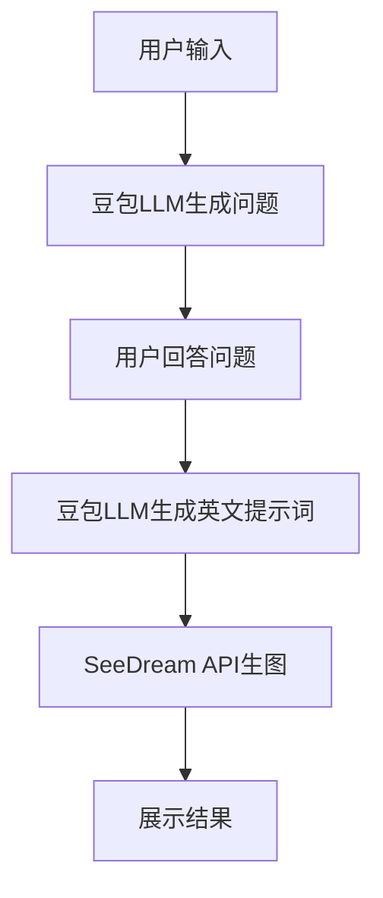

# AI 深度对话生图系统

## 系统概述

本系统集成了豆包语言模型和SeeDream生图API，实现了智能深度提问 → 精准生图的完整流程。

## 核心功能

### 1. 智能深度提问 🤖
- **豆包语言模型**: 使用API Key `5376f0d2-88cf-41c8-ab9c-b7701e4fba81`
- **智能问题生成**: 根据用户初始需求自动生成3-5个深度问题
- **个性化咨询**: 涵盖场合、风格、颜色、季节等关键要素

### 2. SeeDream生图API 🎨
- **API端点**: `https://ark.cn-beijing.volces.com/api/v3/images/generations`
- **模型**: `doubao-seedream-4-0-250828`
- **特性**: 支持连续图片生成、2K高清输出、水印保护

### 3. 对话式交互 💬
- **渐进式提问**: 逐步深入了解用户需求
- **实时反馈**: 显示问答进度和状态
- **智能跳转**: 可选择跳过问答直接生图

## 技术架构

### API集成
```typescript
// 豆包语言模型
DOUBAO_LLM: {
  API_KEY: '5376f0d2-88cf-41c8-ab9c-b7701e4fba81',
  ENDPOINT: 'https://ark.cn-beijing.volces.com/api/v3/chat/completions',
  MODEL: 'doubao-pro-4k'
}

// SeeDream生图
SEEDREAM_IMAGE: {
  API_KEY: '5376f0d2-88cf-41c8-ab9c-b7701e4fba81',
  ENDPOINT: 'https://ark.cn-beijing.volces.com/api/v3/images/generations',
  MODEL: 'doubao-seedream-4-0-250828'
}
```

### 页面流程
1. **主页** → 用户输入需求
2. **对话页** (`/chat`) → 智能提问收集信息
3. **生图页** (`/generate`) → 展示生成的图片

## 使用流程

### 用户操作步骤
1. **输入需求**: "我明天面试穿什么"
2. **智能问答**: AI提出5个深度问题
   - 您希望在什么场合穿这身衣服？
   - 您更偏向什么风格？（正式、休闲等）
   - 您有特定的颜色偏好吗？
   - 您的年龄大概在什么范围？
   - 现在是哪个季节？
3. **回答问题**: 逐一回答AI的问题
4. **生成提示词**: AI基于回答生成英文生图提示词
5. **图片生成**: 调用SeeDream API生成高质量图片
6. **结果展示**: 显示多张图片，支持切换、下载、分享

### API调用流程


## 功能特性

### 智能问题生成
- 根据用户需求自动生成相关问题
- 涵盖穿搭的关键要素
- 支持JSON格式和文本格式解析

### 多图片生成
- 支持连续图片生成（最多3张）
- 图片切换器界面
- 单张/批量下载功能

### 用户体验优化
- 实时进度显示
- 加载状态提示
- 错误处理和重试机制
- 跳过选项（快速生图）

## 配置说明

### 环境变量
```bash
# 豆包API Key
DOUBAO_API_KEY=5376f0d2-88cf-41c8-ab9c-b7701e4fba81

# API端点
DOUBAO_LLM_ENDPOINT=https://ark.cn-beijing.volces.com/api/v3/chat/completions
SEEDREAM_ENDPOINT=https://ark.cn-beijing.volces.com/api/v3/images/generations
```

### 自定义配置
- 修改 `lib/config.ts` 中的API配置
- 调整 `lib/doubaoService.ts` 中的提问模板
- 自定义 `lib/imageGeneration.ts` 中的生图参数

## 错误处理

### 容错机制
1. **主要API失败** → 自动切换到备用API
2. **问题生成失败** → 使用预设问题或跳过问答
3. **生图失败** → 显示错误信息和重试按钮

### 日志记录
- API调用日志
- 错误信息记录
- 性能指标监控

## 扩展功能

### 计划中的功能
- [ ] 历史对话记录
- [ ] 用户偏好学习
- [ ] 批量图片处理
- [ ] 图片风格迁移
- [ ] 社交分享功能

### 技术优化
- [ ] API响应缓存
- [ ] 图片压缩优化
- [ ] 离线模式支持
- [ ] PWA功能集成

## 部署说明

1. **API配置**: 确保API Key有效且有足够配额
2. **网络环境**: 确保能访问豆包和SeeDream API
3. **性能监控**: 监控API响应时间和成功率
4. **用户反馈**: 收集用户使用体验数据

## 注意事项

- API调用频率限制
- 图片生成时间较长（30-60秒）
- 网络稳定性要求
- 用户隐私保护
